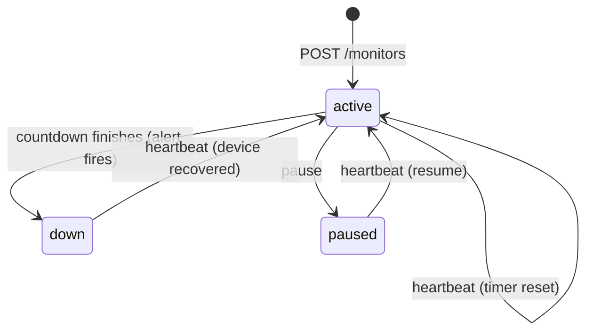

# Pulse-Check API: "Watchdog"

A **Dead Man's Switch** for remote devices (solar farms, weather stations).
Each device registers a monitor with a countdown timer and sends regular
heartbeats. If a device goes silent and its timer reaches zero, the system fires
an alert automatically.

Built with **Python + FastAPI**. State is kept in memory so no database to set up.

---

## How it works

Each monitor gets its own **countdown coroutine** that sleeps for its timeout:

- A **heartbeat** cancels that coroutine and starts a fresh one → the timer resets.
- If a countdown is ever allowed to **finish** (no heartbeat arrived in time),
  the device is marked `down` and an alert is logged.
- **Pause** cancels the countdown so no alert can fire; a heartbeat resumes it.



This per-monitor-task design was chosen for clarity.

---

## Project structure

The code is split by responsibility:

```
pulse-check-api/
├── main.py          # web layer: FastAPI app + routes
├── models.py        # data shapes: Pydantic schemas + Status enum
├── monitors.py      # logic layer: timer state + countdown tasks
├── pyproject.toml   # tooling config (pylint)
├── requirements.txt
├── .gitignore
└── README.md
```

`models.py` describes the data, `monitors.py` does the timer work and `main.py`
just wires it to HTTP. Pydantic validates data at the API boundary; the internal
record is a plain dataclass.

---

## Setup

Requires Python 3.10+.

```bash
git clone https://github.com/rhoda-lee/pulse-check-api.git
cd pulse-check-api

python -m venv .venv
source .venv/bin/activate        # Windows: .venv\Scripts\activate

pip install -r requirements.txt
uvicorn main:app --reload
```

Live at **http://127.0.0.1:8000** — interactive docs at **/docs**.

---

## API Documentation

| Method | Endpoint                      | Purpose                                  |
|--------|-------------------------------|------------------------------------------|
| POST   | `/monitors`                   | Register a monitor and start the timer   |
| POST   | `/monitors/{id}/heartbeat`    | Reset the timer (also resumes / revives) |
| POST   | `/monitors/{id}/pause`        | Pause monitoring (no alerts)             |
| GET    | `/monitors`                   | List all monitors and their status       |
| GET    | `/monitors/{id}`              | Get one monitor's status                 |

**Register**
```bash
curl -X POST http://127.0.0.1:8000/monitors \
  -H "Content-Type: application/json" \
  -d '{"id": "device-123", "timeout": 60, "alert_email": "admin@critmon.com"}'
# 201 Created
```
Returns `409 Conflict` if the id already exists, or `422` if `timeout` is not a
positive number (validated by Pydantic).

**Heartbeat**
```bash
curl -X POST http://127.0.0.1:8000/monitors/device-123/heartbeat
# 200 OK  (404 if the id is unknown)
```

**Pause**
```bash
curl -X POST http://127.0.0.1:8000/monitors/device-123/pause
# 200 OK — send a heartbeat to resume
```

**Status**
```bash
curl http://127.0.0.1:8000/monitors
curl http://127.0.0.1:8000/monitors/device-123
```

**The alert** (logged to the console when a timer expires):
```json
{"ALERT": "Device device-123 is down!", "time": "2026-06-09T06:30:40.815852+00:00"}
```

---

## The Developer's Choice

**Added feature: status endpoints (`GET /monitors` and `GET /monitors/{id}`).**

The original brief gives operators no way to *see* what is being monitored or
which devices are healthy. I added read endpoints so a support engineer can
check the live status of every device at a glance. This is like a natural companion to an
alerting system and the foundation a future dashboard could build on.

---

## Quick manual test

```bash
# register a monitor with a short 5-second timeout
curl -X POST http://127.0.0.1:8000/monitors \
  -H "Content-Type: application/json" \
  -d '{"id": "test-1", "timeout": 5, "alert_email": "me@example.com"}'

# wait 5 seconds WITHOUT sending a heartbeat, then watch the server terminal:
# ALERT: Device test-1 is down!

# confirm the status flipped:
curl http://127.0.0.1:8000/monitors/test-1     # "status": "down"
```
